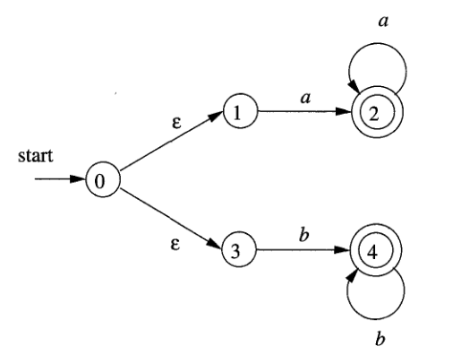

# 02 - Automates Finis

## Le problème posé
Pour un compilateur, au commencement du processus de compilation, tout fichier avec de code est vu comme une chaîne de caractères dans lequel il faut identifier les mots composants et les partager dans des jetons (*tokens*). Pour faire cela, on a besoin d’une méthode pour reconnaître certaines sous-chaînes dans le texte initial. Les automates finis offrent une bonne solution à ce problème.

## Définitions

Du point de vue mathématique, on definit les automates finis comme un tuple composé par:
- un ensemble fini des états $S$;
- un ensemble fini de symboles $\Sigma$, nommé **l’alphabet d’entrée** (le chaîne vide $\epsilon$ ne fait jamais partie de $\Sigma$);
- une fonction de transition $f$ qui donne, pour chaque combinaison d’état et symbole d’entrée, l'ensemble des états suivants;
- un état $s_0$, nommé état initial;
- un ensemble d’états F, un sous-ensemble de $S$, nommés états finals.

On utilise les automates finis de la manière suivante: on commence dans l’état initial et on lit le premier caractère de notre chaîne. On applique la fonction de transition pour voir quel est le nouvel état. Ensuite, on prend le deuxième caractère du chaîne avec ce nouvel état et on applique encore une fois la fonction de transition. On continue jusqu’à la fin de la chaîne.

On dit que l’automate **accepte la chaîne** si l’état final appartient à F. L’ensemble des chaînes acceptées par un automate s’appelle **le langage** de cet automate.

Il y a deux genres d’automates finis:
- **déterministe** (AFD): la fonction de transition n’accepte **jamais** $\epsilon$ comme entrée (on ne peut pas passer d’un état vers un autre sans recevoir un caractère) et la fonction de transition donne **un seul état** pour chaque combinaison d’état et symbole d’entrée (en recevant un caractère, il n'y a qu'une seule transition possible qui détermine l'état suivant);

- **indéterministe** (AFI): la fonction de transition **accepte** $\epsilon$ comme entrée (on peut passer d’un état vers un autre sans recevoir un caractère) et la fonction de transition **peut donner plusieurs ou aucun état** comme résultat (en recevant un caractère, il peut y avoir aucune transition ou plusieurs transitions possibles).

## Représentation graphique
On peut représenter les automates finis commes des graphes orientés dans lesquels les noeuds sont les états de S et la fonction de transition est marquée par poser les symboles correspondants sur les arêtes (par exemple, la transition de $s_0$ à $s_1$ avec le symbole ’a’ est représentée comme une arête de $s_0$ à $s_1$ avec la valeur ’a’). Cela est parfois plus facile que la définition mathématique.

Exemple de AFD:


Exemple de AFI:



:::info
    L’état initial est indiqué par une fléche et le mot “start”. Les états finals sont indiqués par un cercle double.
:::

:::tip
    Observez, pour chaque automate fini, ses caractéristiques:
  - pour AFD, chaque état a seulement deux transitions possibles, correspondant aux symboles de l’alphabet $\Set{a, b}$
  - pour AFI, on a des transitions avec $\epsilon$ (de $s_0$ à $s_1$ et à $s_3$) et quelques transitions n’existent pas ($s_1$ ou $s_2$ avec ’b’ et $s_3$ et $s_4$ avec ’a’)
:::

## Implantation

Avant de commencer l'implantation elle-même, il faut établir quelques conventions:
- pour représenter les états d’un automate qui reconnaît un modèle de $m$ caractères, on va utiliser les nombres entiers de 0 à m (inclusivement);
- pour l’alphabet, on prendra une liste de caractères (dans le sense plus abstrait, l’alphabet peut être n’importe quel type de données, mais pour ce travail pratique, les caractères nous suffisent)

### I. Avec l'instruction `when()`
La plus simple manière d’implanter un AFD, c’est avec une instruction `when()` qui a une branche pour chaque élément de l’alphabet. Ensuite, dans chacune de cettes branches, il faut vérifier dans quel état on se trouve, toujours avec une instruction `when()`. Pour déterminer l’état prochain, on regarde la fonction de transition correspondante. Après avoir lu un caractère, on vérifie toujours l’état courrant pour vérifier si on est arrivé à l’état final. 

Voici un morceau de code qui appartient au AFD donné dans l’image précédente:

````kotlin
    //fonction pour trouver les sous-chaînes dans un texte T
    fun find_pattern(T: String){
        var q = 0               //l’état initial - comme on a déjà dit, on utilise des nombres entiers
        for(c: Char in T){      //parcourir le texte donné
            q = when(c){        //le premier when() est pour l’état courant
                'a'-> when(q){  //le deuxième pour l’alphabet
                    0-> 1
                    1-> 1
                    /*
                    Les situations réstantes
                    */
                }
                'b'-> when(q){
                    /*
                    Les situations réstantes
                    */
                } 
            }
            if(q==3){       //l’état final
                println("On a trouvé la sous-chaîne dans T")
            }
        }
    }
````

### II. À partir d’un modèle

C’est assez facile d’implanter un AFD en sachant son fonction de transition (du coup, elle fait partie de la définition mathématique). Une autre chose qu’on peut faire, c’est d’essayer de déterminer la fonction de transition à partir d’un modèle donné (qui est la sous-chaîne à reconnaître).


On peut commencer par le constructeur d’une classe pour implanter un automate fini déterministe:
````kotlin
class DFA(
    val pattern: String,         // le modèle à trouver
    val alphabet: List<Char>,    // l'alphabet 
    val startState: Int,         // l’état initial
    val endStates: List<Int>     // les états finals
) { /* code de la classe */}
````

On va représenter la fonction de transition par un HashMap qui a comme clés des paires (Int, Char) signifiant l’état courant (Int) et le caractère lu (Char) et des valeurs Int pour l’état résultant.

Pour le pseudo-code d’un automate fini ayant l’état initial $0$, le seul état final $m$ et la fonction de transition $f$ qui doit reconnaître un modèle $P$ de longueur $m$ dans un texte $T$ de longueur $n$:
````kotlin    
    fun find_pattern(T, m):
        val n = T.length
        var q = 0                           //l’état initial
        for i=0 to n:                       //parcourir le texte
            q = f(q, T[i])                  //appliquer la fonction de transition pour obtenir l’état suivant
            if(q==m):                       //l’état final - pour plusieurs états finals, on fait plusieurs comparaisons
                print("On a trouvé P dans T")            
````
On peut voir que, sachant la fonction de transition, on a seulement besoin de parcourir le texte et de toujours verifier l’état dans lequel on se trouve. Il se pose maintenant le problème suivant : comment déterminer cette fonction de transition? 

Pour un modèle $P$ et un alphabet $S'$, on obtient la fonction de transition $f$:

````kotlin
    fun compute_transition_function(P, S'): 
        val m = P.length
        for q=0 to m:
            for a in S' :
                var k = min(m+1, q.index()+2)
                repeat:
                    k = k-1                 
                until P[0..k] is a suffix for (P[0..q] || a)
                f(q, a) = k
        return f    
````

Dans ce code, l’opérateur `||` signifie la concatenation et `P[0..k]` est la sous-chaîne de P à partir de la position 0 jusqu’à la position k (exclusivement).

Prenons un exemple pour mieux comprendre: pour l’AFD donné avant, on a $P="abb"$. Supposons qu’il faut calculer la fonction de transition pour la paire $(0, 'b')$, donc pour $q=0$ et $a='b'$. $k$ sera $2$ au moment de l’initialisation et, ensuite, il devient $1$. La sous-chaîne `P[0..k]` sera  $"a"$ et `P[0..q] || a` sera $"b"$, donc la première n’est pas un suffixe pour la deuxième. On continue et, à l’itération prochaine, on trouvera `P[0..k]` le chaîne vide, donc la condition est toujours vraie. On sort avec $k=0$ et, donc, $f(0, b)=0$, ce qui est vrai. 

## Exercices
1. Pour l’AFD et les mots donnés, écrivez les états et les transitions et dites si les mots sont acceptés: 
 - bbabaa
 - aaababb
 - abbbabab


2. Utilisez ce [site](https://madebyevan.com/fsm/) pour créer les automates finis suivants:
- un AFI qui accepte les chaînes: 011001, 11110000 et 10010011
- un AFD qui accepte les chaînes: abbccc, cbaaab et acccbaab
- un AFD avec l'alphabet {'a', 'b'} le langage duquel est l'ensemble des chaînes avec le nombre de ’a’ multiple de 3
- un AFD avec l'alphabet {'a', 'b'} le langage duquel est l'ensemble des chaînes avec un nombre paire de 'a' et un nombre impaire de 'b'

3. Ouvrez le fichier `TP2/Ex3/src/main/kotlin/Main.kt` dans les fichiers du TP. Suivez les `TODO` pour completer l’implantation du AFD donné à l’exercice no. 1 en utilisant l'instruction `when()`.

4. Ouvrez le dossier `TP2/Ex4/src/main/kotlin` dans les fichiers du TP. Remplissez la classe `DFA.kt` dans les fichiers du TP en suivant les `TODO`. Utilisez l'implantation obtenue pour un automate qui cherche le modèle "aabab". Affichez les positions des occurences du modèle dans la chaîne "aaababaabaababaab" 

5. (Bonus) Implantez en Kotlin le dernier automate de l'exercice no. 2.