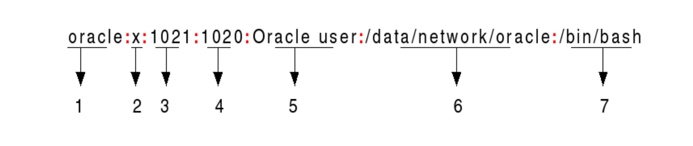

# 03 - Expressions régulières

## Introduction
Le TP précédent, on a étudié les automats finis, un moyen d’identifier certaines sous-chaînes dans un texte. Le problème d’AFDs a été la manière lourde dans laquelle il faudrait les implanter. Aujourd’hui, on va apprendre un autre moyen plus déclaratif de décrire les sous-chaînes cherchées: **les expressions régulières** (ou **RegEx**). Plus concretèment, on va voir comment utiliser les RegEx pour décrire facilement des modèles complexes, pour lesquels les chaînes de caractères ne suffisent pas. 

Dans un compilateur, on utilise les RegEx dans le processus de reconaissance de jétons (tokens), pour partager le code entier dans ses composantes: instructions, définitions et noms des variables ou des fonctions. 

## Opérateurs et construction de RegEx
Dans la construction des RegEx on utilise des opérateurs aussi que des caractères.


### Opérateurs mathématiques
|Expréssion|Correspond à|Exemple|
|:--------:|-----------|:------:|
|a|Le caractère 'a'.| a|
|"abcca"|La chaîne "abcca".| "abcca"|
|.|Remplace tout caractère.| a.b|
|^|Commencement du texte. | ^abc|
|$|Fin du texte. | abc$|
|\[abc...\]|L’un des caractères de l'ensemble $\Set{a, b, c, ...}$.| \[abc\] |
|\[^abc...\]|Tout caractère qui ne se trouve pas dans l'ensemble $\Set{a, b, c, ...}$.| \[^abc\] |
|()| Groupe. On utilise le groupe quand on veut appliquer un opérateur sur une expréssion (comme les parathèses en mathématiques).| (a\|b)*a| 
| [0-9] |Intervalle- corréspond à tout caractère entre les deux bornes (inclusivement). | [0-9]|

La plupart de langages de programmation offre du support pour les expressions régulières, mais les opérateurs qu’ils utilisent peuvent varier de l'un à l’autre.

### Extensions en Kotlin
|Expréssion|Correspond à|Exemple|
|:--------:|-----------|:------:|
|r1 \| r2 | r1 ou r2.| a \| b |
|r1(?=r2)| r1 quand il est suivi par r2.| abc(?=123) | 
|\\w| Alphanumérique et _ .| \\w |
|r*|Zéro ou plusieures occurences de la chaîne r.| a*|
|r+|Une ou plusieures occurences de la chaîne r.| a+|
|r?|Zéro ou une occurence de la chaîne r.| a+|
|r\{m, n\}| Entre m et n occurences de r.| a{3, 7}|
|.| Remplace tout caractère **que la ligne nouvelle (`newline`)**.| a.b|

:::tip
Si on a besoin d’utiliser dans un RegEx la valeur d’caractère qui est aussi un opérateur (\*, \?, \^), il faut ajouter un "\\" devant lui: "\\*", "\\?", "\\^".
:::

### Exemples
- Un RegEx qui reconnaît les chaînes "aaba", "aaca", "baba": `(a|b)a(b|c)a`.
  
:::tip[Raisonement]
    La reconnaîssance des modèles en utilisant les RegEx se passe caractère par caractère: on prend le premier caractère du RegEx (qui, dans notre cas, est l’expression a ou b) et on le compare avec le premier caractère dans chaque chaîne. On peut voir que les trois chaînes commencent avec a ou b, donc, jusq’à ce point, le modèle determiné par le RegEx se trouve dans les trois chaînes. On continue avec le caractère suivant dans l’expression, qui est tout simplement a, et qui se trouve en tant que deuxième caractère toujours dans les trois chaînes. Le processus continue jusqu’à la fin de l’expression régulière.
:::

- Un RegEx qui reconnaît les numéros entièrs: `(-)?[1-9][0-9]*`.

- Un RegEx qui reconnaît les chaînes qui commencent avec 'a', se terminent avec 'a' et contiennent que 'a' ou 'b' à l’intérieur: `a(a|b)*a`.

## Regex en Kotlin
Kotlin, comme d’autres langages de programmation, offre déjà une implantation pour les RegEx: la classe `Regex()`. On peut instantier un objet de type `Regex` soit en utilisant le constructeur de la classe, soit avec la méthode `toRegex()` sur un `String`.

```kotlin
    //instantiation avec le constructeur
    val myRegex = Regex("a(a|b)*a")

    //instantiation à partir d’un String
    val myOtherRegex = "(-)?[1-9][0-9]*".toRegex()
```

La classe expose beaucoup de méthodes et on vous encourage de jetter un coup d’oeil sur la documentation officielle dans la séction de sources. Parmi les plus importantes, on trouve:

```kotlin
    //retourne la première correspondance dans input, en chercheant à partir de startIndex
    fun find(
        input: CharSequence,
        startIndex: Int = 0
    ): MatchResult?

    //la même chose que find, mais retourne une séquence de toutes les correspondances
    fun findAll(
        input: CharSequence,
        startIndex: Int = 0
    ): Sequence<MatchResult>

    //partage input autour des occurences du regex
    fun split(
        input: CharSequence,
        limit: Int = 0
    ): List<String>
```

## Exercices
1. Completez les exercices sur ce [site](https://regexone.com/lesson/introduction_abcs).
2. Pour chacun des RegEx suivants, donnez 3 exemples de chaînes qui correspondent:
   - (($\epsilon$\|a)b*)*
   - a\*ba\*ba\*ba\*
  
    Vérifiez la correspondance avec ce [site](https://regex101.com/).
3. Écrivez des expressions régulières pour reconnaître:
   - l’ensemble des chaînes sur l’alphabet $\Set{a, b, c}$ qui contiennent au moins un 'a' et au moins un 'b'
   - l’ensemble des chaînes sur l’alphabet $\Set{0, 1}$ qui contiennent une seule paire de '1's consécutives
4. Ouvrez les fichiers de laboratoire. Regardez le fichier TP03/Ex4/etc/passwd. C’est un fichier texte qui a le format du fichier etc/passwd dans Linux. Chaque ligne a le format suivant:   

    1. `Username`: le nom d’utilisateur. Contient entre 1 et 32 caractères
    2. `Password`: un caractère 'x' qui indique que le mot de passe est encodé et situé dans le fichier `/etc/shadow_file`
    3. `User ID`: identificateur d’utilisateur (un nombre sur 16 bits)
    4. `Group ID`: identificateur du group (toujours un nombre sur 16 bits)
    5. `User info`: un champ pour des commentaires
    6. `Home directory`: le chemin absolut du directeur dans lequel l’utilisateur se trouve au moment de la connexion
    7. `Command/shell`: le chemin absolut d’une commande
   
    Les champs sont separés avec des `:`. On demande: 
      - écrivez une expression régulière qui accepte toutes les lignes du fichier;
      - completez le code du fichier TP03/Ex4/Passwd.kt pour écrire un programme qui trouve toutes les commandes disponibles pour un nom d’utilisateur donné


5. (Bonus) Ouvrez les fichiers de laboratoire. Regardez le fichier TP03/Ex2.txt. Vous avez un fichier texte qui contient des lignes avec des chiffres et des caractères comme les lignes suivantes: 

```
    two1nine
    eightwothree
    abcone2threexyz
    xtwone3four
    4nineeightseven2
```

 Parfois, ces caractères peuvent écrire des chiffres eux-mêmes (par exemple: pour la première ligne, on a `two` et `nine`). Sachant cela, trouvez la première et la dernière chiffre dans chaque ligne et calculez la somme de toutes cettes chiffres. 

## Bibliographie
1. *Introduction to Automata Theory, Languages and Computation - 3rd edition*- Chapitre 3: Regular Expressions
2. *Compilers: Principles, Techniques & Tools - 2nd Edition* - Chapitre 3.3: Specification of Tokens 
3. [RegEx en Kotlin](https://kotlinlang.org/api/latest/jvm/stdlib/kotlin.text/-regex/)
4. [Regex101](https://regex101.com/)
5. [Introduction à RegEx](https://regexone.com/lesson/introduction_abcs)

