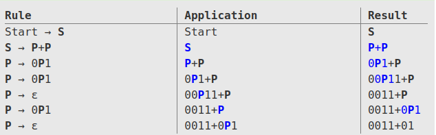
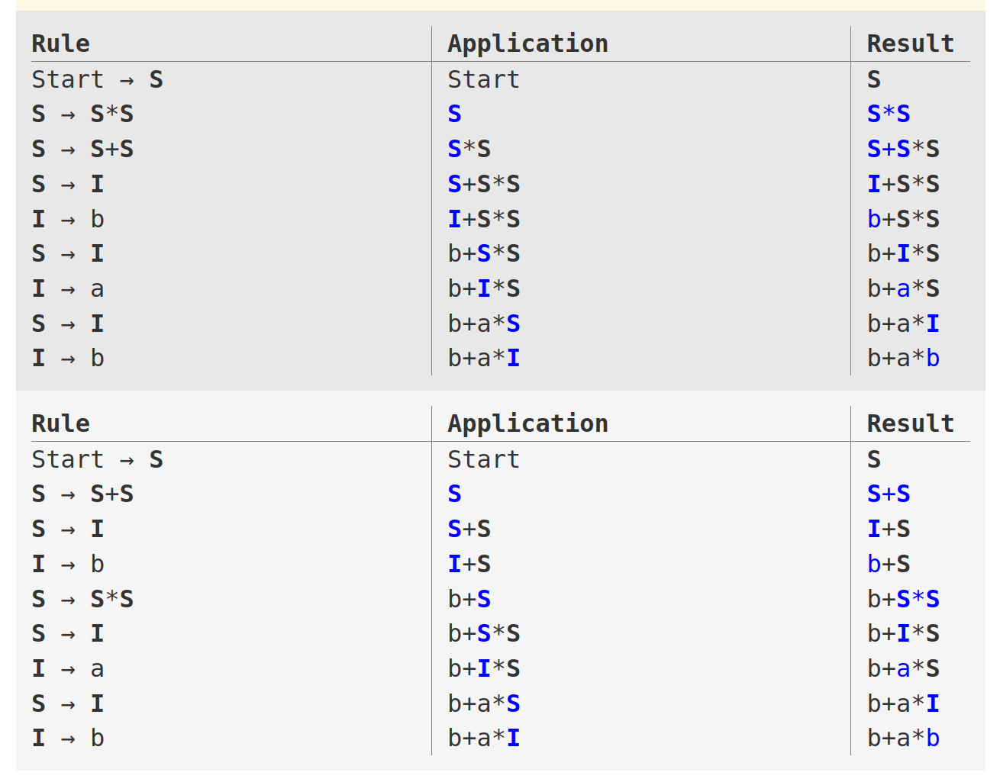

# 04 - Grammaires indépendantes de contexte

## Introduction
Dans les TPs précédents, on a appris comment concevoir des modèles pour decrire des chaînes de caractères. Aujourd’hui, on va voir un outil pour définir des règles pour les langages de programmation. Cet outil s’appelle **une grammaire**.

Plus précisément, on va étudier les grammaires indépendantes de contexte. De manière informelle, on dit qu’elles posent **des règles récursives** sur l’ordre dans laquelle se trouvent les jétons dans un langage de programmation et la structure des instructions. Observez qu’on étudie les grammaires à partir des langages qu’elles décrivent.

## Définitions
Du point de vue mathématique, on definit une grammaire indépendante de contexte comme un tuple composé par:
- un ensemble fini de symboles à partir desquels on compose les chaînes du langage défini. On appelle cet ensemble les **terminaux**;
- un ensemble fini de **variables**, ou **non-terminaux** (ou catégories syntaxiques), qui sont décrites en utilisant les terminaux ou d’autres variables;
- une variable qui représent le langage défini par la grammaire, qu’on appelle **symbole de début**;
- un ensemble fini de **règles** (ou **productions**) qui représentent la définition récursive du langage. Chaque production contient: 
  - une variable définie par la production (appelée **la tête de la production**- elle se trouve dans la partie gauche de la production)
  - le symbole de production
  - une chaîne de zéro ou plusieurs terminaux et variables (appelée **le corps de la production**) qui représente un moyen de décrire la variable située dans la tête de la production. Cette chaîne peut aussi être une **expression régulière** construite en utilisant les variables et les terminaux.

### Exemple
Pour definir un langage qui accepte les expréssions des sommes entre deux nombres contenant des 0 consécutives suivis par des 1 consécutives:
$$
  S \rightarrow P + P \tag{1}
$$
$$
  P \rightarrow 0P1 \tag{2}
$$
$$
  P \rightarrow \epsilon  \tag{3}
$$
Dans cet exemple, il y a:
- les terminaux: $$\{+, 0, 1\}$$
- les non-terminaux: $$\{P, S\}$$
- le symbole de début: $$S$$ 
- trois productions $(1), (2), (3)$

Chaînes acceptées:
- `00001111+0011`
- `01+0011`
- `+01`
- `+`

:::warning
  Même si vous voyez l’opérateur arithmétique '+', sachez qu’ici il ne s’agit pas de l’addition! On parle strictement des chaînes de caractères, donc on a besoin exactement du caractère '+'.
:::

## Dérivations d’une grammaire
Étant donnée une chaîne quelconque et une GIC, il faut avoir un moyen pour vérifier si elle se trouve dans le langage défini par la GIC. Il y a deux approches pour cette déduction. La première, c’est d’utiliser les productions à partir du corps, vers la tête. On prend des chaînes qui sont dans le langage du chaque variable dans le corps et on fait leur concatenation, en déduisant que la chaîne résultante appartienne au langage de la tête. On appelle cette procedure **déduction récursive**.

La deuxième approche pour définir le langage d’une grammaire, c’est à partir de la tête et vers le corps des productions. On commence par développer le symbole de début en utilisant une de ses productions. On continue à développer le résultat en remplaçant l’une des variable dans le corps par une de ses productions. On continue ce processus jusq’au moment qu’on arrive à une chaîne contenant que des terminaux. Cette approce s’appelle **dérivation**.

Prenons un exemple de dérivation pour la grammaire donnée avant et la chaîne `0011+01`:


Voyons ce qui se passe: dans la colonne `Rule`, on peut voir la production qu’on utilise pour la dérivation. Dans `Application`, on voit, en bleu, la variable de l’expression courante qu’on va développer. Dans `Result` on voit l’étape courante dans la dérivation. On commence avec le symbole de début, S. En utilisant la production (1), on remplace S avec P+P. Ensuite, on prend le premier P et on commence à lui développer (toujours la variable en bleu).

Vous avez vu qu’on a commencé avec la variable la plus à gauche du notre résultat. On appelle cette méthode **la dérivation la plus à gauche** (**leftmost derivation**). Si on faisait la même chose, mais à partir de la variable la plus à droite, on appellerait cette méthode **la dérivation la plus à droite** (**rightmost derivation**).

### Grammaires ambiguëes
On appelle **grammaires ambiguëes** les grammaires pour lesquelles les deux dérivations (la plus à gauche et la plus à droite) sont **différentes**. Prenons l'exemple suivant de grammaire et l'expression `b+a*b`:

$$
  S \rightarrow I \tag{1}
$$
$$
  S \rightarrow S+S \space | \space S*S \tag{2}
$$
$$
  S \rightarrow (S) \tag{3}
$$
$$
  I \rightarrow a \space | \space b \space | \space Ia \space | \space Ib  \tag{4}
$$

Maintenant, si on vérifie avec la même chaîne qu’avant, on va trouver qu’il y a deux dérivations possibles:


:::warning[Éliminer les ambiguïtés]
Il n’y a pas d’algorithme qu’on peut utiliser toujours pour éliminer les ambiguïtés. Du coup, il y a des langages formels qui peuvent être décrites que avec des grammaires ambiguëes.

D’habitude, la raison pour les ambiguïtés est une situation bien connue. Dans notre exemple, elle provient du fait qu’on ne respecte pas la priorité des opérateurs. 
:::

Pour corriger notre grammaire, il faut imposer la priorité des opérateurs. On va partager les expression possibles dans les catégories suivantes, dans une ordre hiérarchique: des sommes, des produits, des expressions entre parathèses et des identificateurs. Pour chacune de cettes catégories, on va utiliser une variable en tant que tête d’une production. Dans le corps de la production correspondante, on aura une occurence de la variable suivante dans la hiérarchie. La grammaire devient:

$$
  S \rightarrow T \space | \space E+T \tag{1}
$$
$$
  T \rightarrow F \space | \space T*F  \tag{2}
$$
$$
  F \rightarrow I \space | \space (E)  \tag{3}
$$
$$
  I \rightarrow a \space | \space b \space | \space Ia \space | \space Ib  \tag{4}
$$

## Exercices
0. Ouvrez ce [site](https://web.stanford.edu/class/archive/cs/cs103/cs103.1156/tools/cfg/). Écrivez la grammaire précédente, avec les ambiguïtés corrigées. Utilisez trois chaînes avec des multiplications, sommes et paranthèses pour vérifier qu’on a seulement une dérivation pour n’importe quelle chaîne décrit par la grammaire.

1. Travaillez sur le même site que pour exercice 0. Écrivez une grammaire qui reconnaît une instruction de déclaration d'une variable, ayant la syntaxe suivante:
```c
  <nom_du_type> <nom_de_la_variable> ;

  //Exemples:
  int a;
  char b23;
  long mnop1;
```
Où:
- le nom du type est l'un des options suivantes: `int`, `long`, `bool`, `char`
- le nom de la variable est une chaîne qui peut contenir des lettres et des nombres, mais ne peut pas commencer avec un nombre

Testez votre grammaire avec les exemples.

:::warning
  Faites attention aux `;`. Ils doivent toujours apparaître dans la déclaration!
:::

2. Travaillez sur le même site que pour exercice 0. Écrivez une grammaire qui reconnaît des expréssions mathématiques (somme, soustraction, produit, division et paranthèses) avec des nombres entières et des noms de variables (les noms des variables ont les mêmes règles que pour éxercice no. 1).

```c
  //Exemples:
  1-3+20;
  22+var12;
  (a*b)/c+1;
```

3. Travaillez sur le même site que pour exercice 0. Combinez les deux grammaires des exercices précédents pour obtenir une grammaire qui accepte les genres suivants d'instructions:
```c
  //déclaration d'une variable
  <nom_du_type> <nom_de_la_variable> ;
  //Exemples:
  int a;
  char b23;
  long mnop1;
```

```c
  //attribution d'une expression avec des nombres entières à une variable
  <nom_de_la_variable> = <expression> ;

  //Exemples:
  ab = 3;
  x = 3 + 2 * 7;
```

```c
  //déclaration d'une variable avec une attribution
  <nom_du_type> <nom_de_la_variable> = <expression>;

  //Exemples:
  int y = -78;
  long a8 = 123;
```

:::tip
  Pour ce TP, ne vous concernez pas avec la corréspondance entre les types des variables et les expressions attribuées. Votre grammaire peut accepter des lignes comme `char a = 2*3;`
:::

4. (Bonus) Écrivez une grammaire sur l’alphabet $\Set{a, b}$ qui accepte les chaînes contenant $m$ apparitions de 'a' et $n$ apparitions de 'b', avec $m>n$.

## Bibliographie
1. *Introduction to Automata Theory, Languages and Computation - 3rd edition*- Chapitre 5.1.1-5.1.2
2. *Compilers: Principles, Techniques & Tools - 2nd Edition* - Chapitre 2.2.1 
3. [Site pour écrire des GICs](https://web.stanford.edu/class/archive/cs/cs103/cs103.1156/tools/cfg/)
   
