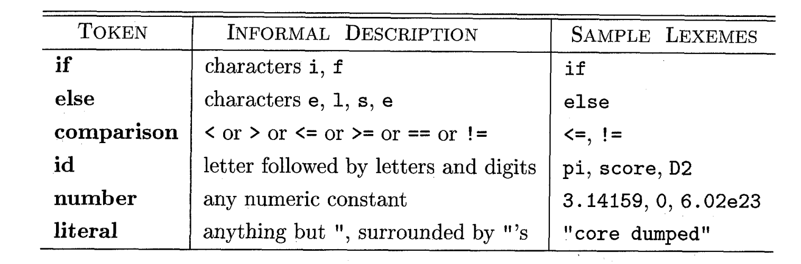
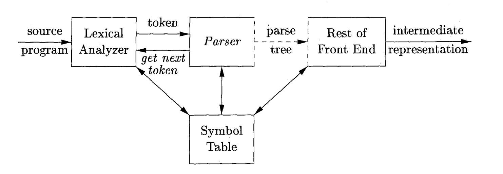
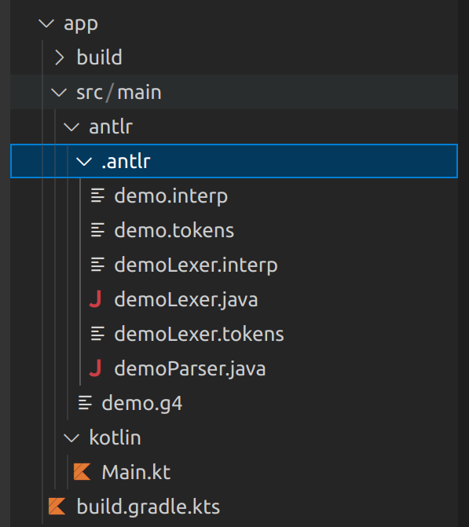
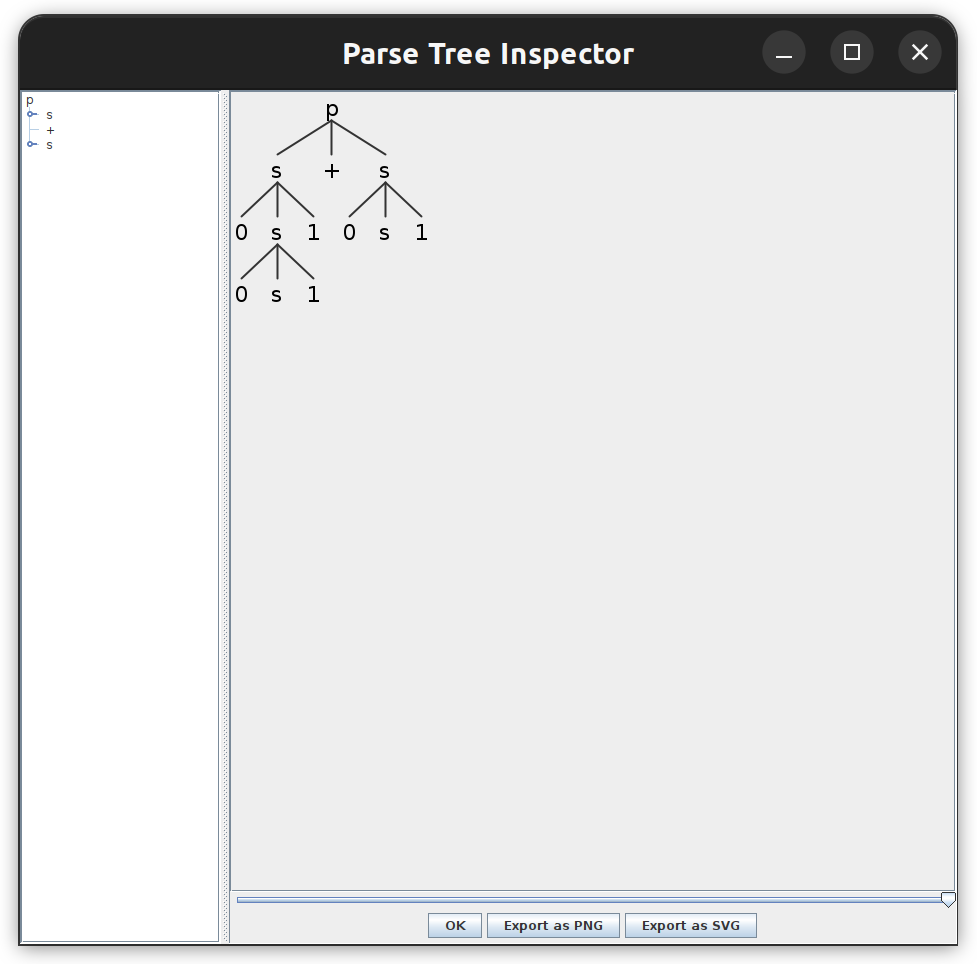

# 05 - ANTLR Lexer et Analyseur

Le TP précédent, on a vu comment écrire des grammaire pour décrire les langages de programmation. Maintenant, on commence la transition de la partie des langages formels vers les compilateurs.

## Lexer
Le **Lexer** est une composante du compilateur. Son but est de lire le texte d’entrée (qui est notre programme source) et de produire en tant que sortie une **séquence de jétons**. Les erreurs qui apparaissent au niveau du **Lexer** sont des **erreurs d’analyze lexicale**.

Dans le contexte du Lexer, on introduit les définitions suivantes:
- le **jéton** (**token**) est une paire qui contient le nom du jéton et une valeur. Le nom du jéton est un symbole abstrait qui représente un genre d’unité lexicale. 
- le **modèle** est une description de la forme que les lexemes d’un jéton peuvent avoir. Si le jéton représent un mot clé (par exemple, le mot clé if), le jétons est une chaîne de caractères qui composent le mot. Pour d’autres situations (par exemple, pour définir des noms pour les variables), on utilise des expréssions plus complexes (comme les RegEx).
- le **lexème** est une séquence de caractères dans le programme source qui correspond au modèle d’un jéton et est identifié par le Lexer comme une instance du jéton.



## Analyseur (Parser)
**L'Analyseur** obtient la séquence de jétons produite par le Lexer et vérifie si elle peut être générée par la grammaire du langage source. La sortie du Analyseur est l’arbre d’analyze (Parse Tree). Les erreurs qui apparaissent au niveau du Analyseur sont des **erreurs d’analyse syntaxique**.



:::tip
  Vous pouvez ignorer, pour ce TP, le tableu de symboles. On va le discuter dans un TP prochain!
:::

## Grammaires avec ANTLR4
À partir de ce TP, on va utiliser ANTLR pour l’analyse du texte. ANTLR (ANother Tool For Language Recognition) est un outil pour generer des analyseurs (parsers) qui permettent le traitement, l’exécution et la traduction du code. On va employer ANTLR pour la partie de front-end de notre compilateur.

Pour les grammaires indépendantes du contexte, ANTLR utilise des fichiers `.g4`. Pour écrire une grammaire, il faut créer un fichier avec le même nom que la grammaire que vous souhaitez définir. 

### Terminaux
En ANTLR, on peut même utiliser des productions pour décrire les terminaux. Dans ce cas, le corps de la production doit contenir que des terminaux. On va identifier les terminaux avec des noms qui commencent avec des lettres **MAJUSCULES** (On vous conseile d’utiliser que des majuscules pour les terminaux, pour pouvoir les distinguer plus facilement). D’habitude, on trouve les définitions des terminaux à la fin de la grammaire.

```antlr4
  INTEGER: (-)?[0-9]+ ;  //un terminal pour représenter les nombres entières
  WHITESPACE: ' ' ; //un terminal pour représenter les espaces blancs
  VARIABLE_NAME: [a-zA-Z]+ //un terminal pour représenter les noms des variables
```

### Règles

On va identifier les non-terminaux avec des lettres **minuscules**.

:::warning
En ANTLR, on **ne peut pas avoir des productions avec la même tête**. Ce qu’on peut faire, c’est de mettre les deux corps dans un seul et de les séparer avec l’opérateur `|`.
:::

```antlr4
  assignment: VARIABLE_NAME '=' INTEGER ; //une règle pour représenter une affectation
  
  //une règle pour représenter une expression d'addition
  addition: addition '+' INTEGER
          | INTEGER
          ;
```

## Exemple
Prenons la grammaire de la semaine dernière et écrivons-la en ANTLR:

```antlr4
grammar demo;

ZERO: '0';
ONE: '1'; 
p : s '+'s;
s : ZERO s ONE  
  | ZERO ONE
  |;
```

:::tip[Nos conseils pour écrire des grammaires pour les langages de programmation]
  Quand vous commencez à écrire une grammaire pour n’importe quel langage de programmation, on vous conseil de suivre les étapes suivantes:
  - identifiez les instructions possibles dans le langage (la déclaration des variables, les boucles, les instructions de contrôle)
  - pour chacune de cettes instructions, déterminez les parties composantes (les mot clés, les noms des variables/fonctions, les expréssions mathématiques)
  - pour chacune de cettes instructions, écrivez les règles de Lexer pour ses composantes et, ensuite, écrivez une règle pour décrire l’instruction elle-même
  - vérifiez, après chaque nouvelle instruction ajoutée, le comportement du Lexer et Parser générés par ANTLR.
:::


## Analyseur et Lexer avec ANTLR
Au lieu d’écrire vous-mêmes le lexer et l'analyseur, ANTLR peut les générer automatiquement à partir de votre grammaire. Vous devez seulement les utiliser dans votre code.

Le fichier avec la grammaire doit se trouver sous le chemin `src/main/antlr`. Après la génération, vous trouvez aussi le dossier `.antlr`, qui contient tous les fichiers générés par antlr.


Pour utiliser ces nouveaux fichiers dans votre code, il faut seulement instantier les classes.

:::tip
  Les noms du lexer et analyseur auront le format suivant: `<nom_de_votre_grammaire>Lexer` et `<nom_de_votre_grammaire>Parser`. Ils sont des sous-classes des classes Lexer et Parser. Pour voir plusieurs détails sur ces classes et les méthodes qu’elles exposent, on vous conseille d’ouvrir la documentation: [lexer](https://www.antlr.org/api/Java/org/antlr/v4/runtime/Lexer.html) et [parser](https://www.antlr.org/api/Java/org/antlr/v4/runtime/Parser.html).
:::

### Lexer

L’exemple suivant montre comment utiliser le Lexer généré par ANTLR à partir de notre grammaire:

```kotlin
  //Afficher les valeurs des jétons du texte
  import org.antlr.v4.runtime.CharStreams
  import org.antlr.v4.runtime.CommonTokenStream

  fun main(){
      val strToParse = "0011+01"
      val lexer = demoLexer(CharStreams.fromString(strToParse))
      val listOfTokens = lexer.allTokens
      for(token in listOfTokens){
          println("Token with value ${token.text} found at line ${token.line} starting from index ${token.startIndex}")
      }
  }
```

La sortie sera:

```sh
  Token with value 0 found at line 1 starting from index 0
  Token with value 0 found at line 1 starting from index 1
  Token with value 1 found at line 1 starting from index 2
  Token with value 1 found at line 1 starting from index 3
  Token with value + found at line 1 starting from index 4
  Token with value 0 found at line 1 starting from index 5
  Token with value 1 found at line 1 starting from index 6
```

### Parser

Les méthodes du notre parser sont obtenues à partir de la grammaire. Dans cet exemple, on commence la construction de l'arbre d’analyse avec la production qui a comme tête la variable $p$. D’habitude, on commence l’analyse avec la régle de début de notre grammaire.

```kotlin
  //Afficher les valeurs des jétons du texte
  import org.antlr.v4.runtime.CharStreams
  import org.antlr.v4.runtime.CommonTokenStream

  fun main(){
      val strToParse = "0011+01"
      val lexer = demoLexer(CharStreams.fromString(strToParse))
      val parser = demoParser(CommonTokenStream(lexer))
      val tree = parser.p()
      println(tree.text)
      for(i in 0 until tree.childCount){
          println(tree.getChild(i).text)
      }
  }
```

La sortie sera:
```sh
  0011+01
  0011
  +
  01
```

On peut voir ici les sorties suivantes: la première ligne est le texte entier (qui corréspond au texte de la variable $p$, la racine de notre arbre d’analyse). Ensuite, on prend les noeuds enfants, qui doivent être une occurence de $s$, un caractère `+` et une autre occurence de $s$. On peut voir que la sortie correspond aux demandes.

:::warning
  On vous conseil de ne pas combiner les deux exemples. C’est-à-dire, soit vous utilisez le Lexer pour afficher/travailler avec les jétons, soit vous continuez avec le Parser. 
  
  On dit cela parce que les mèthodes du Lexer comme getAllTokens ou nextToken() consomme les jétons. Si vous utilisez les premiers trois jétons et ensuite vous continuez avec le Parser, il commencera à partir du quatrième jéton.
:::

### Visualisation de l’arbre d’analyse (parse tree)
À partir de notre code source et de la grammaire, ANTLR peut aussi générer une représentation graphique de notre **arbre d’analyse** (**parse tree**). Pour faire cela, on a besoin du code suivant:

```kotlin
  import org.antlr.v4.runtime.CharStreams
  import org.antlr.v4.runtime.CommonTokenStream
  import org.antlr.v4.gui.TreeViewer
  import java.io.File

  fun main(){
      val strToParse = "0011+01"
      val lexer = demoLexer(CharStreams.fromString(strToParse))
      val parser = demoParser(CommonTokenStream(lexer))
      val tree = parser.p()
      val viewer : TreeViewer = TreeViewer(parser.ruleNames.toMutableList(), tree)
      viewer.open()
  }
```

Quand on exécute le programme, on obtient la fenêtre suivante:


## Exercices

1. (Révision du TP précédent) Ouvrez le dossier `TP5`. Suivez les `TODO-1A` dans le fichier `app/src/main/antlr/tp5.g4` pour écrire une grammaire qui accepte des déclarations des variables ayant la syntaxe suivante:

```c
  <type> <nom_variable>;

  //Exemples
  int var1;
  float _a1b2;
```
Les types possibles sont `int` et `float`. Les noms des variables sont des chaînes de caractères qui peuvent commencer avec un `_` et peuvent contenir des lettres et des chiffres.  
  
Suivez les `TODO-1B` dans le même fichier pour que la grammaire accepte aussi des expressions mathématiques avec des nombres et des variables, en utilisant les opérateurs `+`, `-`, `*`, `/`.

```c
  //Exemple
  2*3+a;
```

Finalement, suivez les `TODO-1C` dans le même fichier pour que la grammaire accepte aussi des affectations (assignments):
```c
  <nom_variable> = <expression>;

  //Exemple
  _ab2 = 12*7+var1;
```

Testez par compiler et exécuter le code. Voyez l’arbre d’analyse et vérifiez vos résultats avec des exemples.

2. Suivez les `TODO-2` pour écrire une grammaire qui accepte des instructions `if` ayant la syntaxe suivante:

```c
  if(<expression>){
    <zéro ou plusieurs instructions>
  }

  //Exemples
  if(2+3/_variable){
    _var2 = 20;
    5*3;
  }
```

3. Suivez les `TODO-3` pour écrire une grammaire qui accepte des définitions des fonctions sans l'instruction de retour. Elles aurient la syntaxe suivante:

```c
  <type_de_retour> <nom_de_la_fonction>(type1 param1, type2 param2 ...){
    <zéro ou plusieurs instructions>
  }

  //Exemples
  int func(int a, float b){
    a = 2 * b;
    int _innervar;
    _innervar = a+b;
  }
```

## Bibliographie
1. *Compilers: Principles, Techniques & Tools - 2nd Edition* - Chapitres 3.1, 4.1
2. [ANTLR Lexer](https://www.antlr.org/api/Java/org/antlr/v4/runtime/Lexer.html) 
3. [ANTLR Parser](https://www.antlr.org/api/Java/org/antlr/v4/runtime/Parser.html)
4. [Règles en ANTLR pour des langages de programmation](https://github.com/antlr/grammars-v4)
   