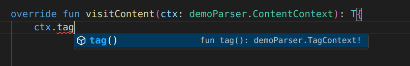

# 06 - Visitor et Bibliothèque

Le TP précédent, on a appris comment utiliser ANTLR pour écrire des grammaires et pour générer un Lexer et un Analyseur. Ensuite, on a réussi de créer et accéder à l’arbre d’analyse de notre code. On a vu qu’on pouvait voir les règles et leurs composantes (les enfants dans l’arbre d’analyse). Ce qui suit, c’est d’utiliser toutes cettes informations dans notre compilateur. 

Pour continuer avec notre traitement (par exemple, pour faire l’analyse du code du point de vue semantique), il faut parcourir l’arbre d’analyse. Parce qu’il s’agit d’un arbre, on peut le traverser en utilisant DFS (depth-first search/recherche en profondeur) ce qui pourrait être un processus assez complexe. On discutera une meilleure option pour travailler avec l’arbre d’analyse et on fera une petite introduction dans la bibliothèque de ALF qu’on utilisera à partir de ce TP.

## Visitor

### Génération

Au dehors du Lexer et Analyseur, ANTLR a aussi l’option de générer un Visiteur. Son but est de simplifier le processus de traitement de l’arbre d’analyse. Le Visiteur offre aux programmeurs un moyen de définir des fonctions qui s’exécutent au moment qu’on arrive à une certaine règle dans notre arbre d’analyse.

Prenons l’exemple suivant d’une grammaire simple qui accepte un format similaire aux fichiers XML:
```antlr4
grammar demo;

start: tag+;

tag: '<' ELEMENT '>' content* '</' ELEMENT '>'
    ;

content:
     ELEMENT
    |tag
    ;

ELEMENT: [a-zA-Z]+;
WS: [ \t\n\r\f]+ -> skip ;
```

Les fichiers XML correspondantes auront la structure suivante:
```xml
<root>
    <child>Value</child>
    <secondChild>
        <inner>InnerValue</inner>
    </secondChild>
</root>
<secondRoot>
    OtherValue
</secondRoot>
```
Vous pouvez voir dans le grammaire que les valeurs, aussi que les noms des étiquettes sont des chaînes contenant seulement des lettres. 

Maintenant, après avoir compilé le programme qui contient notre nouvelle grammaire, on peut voir, dans le dossier `app/build/generated-src/antlr`, l'interface `demoVisitor.java`.

```java
public interface demoVisitor<T> extends ParseTreeVisitor<T> {
	/**
	 * Visit a parse tree produced by {@link demoParser#start}.
	 * @param ctx the parse tree
	 * @return the visitor result
	 */
	T visitStart(demoParser.StartContext ctx);
	/**
	 * Visit a parse tree produced by {@link demoParser#tag}.
	 * @param ctx the parse tree
	 * @return the visitor result
	 */
	T visitTag(demoParser.TagContext ctx);
	/**
	 * Visit a parse tree produced by {@link demoParser#content}.
	 * @param ctx the parse tree
	 * @return the visitor result
	 */
	T visitContent(demoParser.ContentContext ctx);
}
```

Ce qui ce passe c’est qu’au moment de la compilation, ANTLR génère, pour chaque règle de notre grammaire, une fonction pour le visiteur. Cettes fonctions ont le nom `visit<nom_de_la_règle>()`. Le visiteur recevra comme entrée notre arbre d’analyse (la racine duquel corréspond à une règle) et il appellera la fonction corréspondante.

:::tip
Au dehors des fonctions spécifiques à notre grammaire, le visiteur aura toujours la fonction `visit()`, à laquelle on peut donner un paramètre qui appartient à n’importe quelle règle de notre grammaire. Retenez cette fonction, car on l’utilisera beaucoup dans notre code!
:::

Pour chacune de cettes fonctions, on reçoit un paramètre qui représente le contexte du règle dans laquelle on se trouve. Avec ce contexte, on peut accéder au corps de la production. Par exemple, pour le contexte de la fonction `visitContent()`, on aura la fonction `ctx.tag()`, qui renvoie le contexte de la règle `tag` qui existe dans notre variable `content` (voyez la définition du `content` dans la grammaire). Pour plusieurs informations sur les contextes, regardez [ici](https://www.antlr.org/api/Java/org/antlr/v4/runtime/RuleContext.html).



Au dehors de tout simplement accéder aux composantes du corps d’une règle, on peut faire encore une chose: appeller la fonction du visiteur pour la composante (donc aller en profondeur dans l’arbre de parse). On fait cela toujours avec la fonction `visit()`.

### Implantation

On a vu que ANTLR nous a généré une interface. Alors, on aura besoin d’une implantation.
Prenons le même exemple qu’avant e essayons, pour un tel fichier, d’afficher les informations d’une autre manière. L’implantation sera la suivante:

```kotlin
import org.antlr.v4.runtime.tree.AbstractParseTreeVisitor

class TP6Visitor : AbstractParseTreeVisitor<String>(), demoVisitor<String>{

    override fun visitStart(ctx: demoParser.StartContext) : String{
        var result: String = ""
        for(tag: demoParser.TagContext in ctx.tag()){
            val vst = this.visit(tag)
            result += "Found primary tag: \n$vst"
            result +="\n"
        }
        return result
    }

    override fun visitTag(ctx: demoParser.TagContext): String{
        var result: String = ""
        result += "Opening tag with name: ${ctx.ELEMENT(0).text}"
        result += "\n"
        for(content: demoParser.ContentContext in ctx.content()){
            result += this.visit(content)
        }
        result += "Closing tag with name: ${ctx.ELEMENT(1).text}"
        return result
    }

    override fun visitContent(ctx: demoParser.ContentContext): String{
        var result: String = ""
        if(ctx.ELEMENT()!= null){
            result += "Found value inside tags: ${ctx.ELEMENT().text} \n"
        }
        if(ctx.tag()!= null){
            result += this.visit(ctx.tag())
            result += "\n"
        }
        return result
    }
} 
```
La sortie sera la suivante pour les contenus donnés avant:
```
Found primary tag: 
Opening tag with name: root
Opening tag with name: child
Found value inside tags: Value 
Closing tag with name: child
Opening tag with name: secondChild
Opening tag with name: inner
Found value inside tags: InnerValue 
Closing tag with name: inner
Closing tag with name: secondChild
Closing tag with name: root
Found primary tag: 
Opening tag with name: secondRoot
Found value inside tags: OtherValue 
Closing tag with name: secondRoot
```

Ce qu’on a réussi de faire c’est d’identifier, pour chaque étiquette, le nom et la valeur. Il y a encore quelques observations à faire:
- le type de retour de chaque fonction est `String`, mais on peut choisir n’importe quel type. Cela dépend de ce qu’on a besoin.
- d’habitude, pour traiter chaque composante du corps d’une production, on a **deux options**: s’il s’agit d’un jéton, on peut prendre directement le texte (comme pour `ELEMENT`); autrement, on utilise la methode `visit()` pour appeller la fonction du visiteur.
- dans le cas où on peut avoir **plusieurs variables/jétons** du même type dans une règle (par exemple, on peut avoir plusieurs `tag` dans `start`), la méthode renvoie **une liste**
- pour les règles dans lesquelles on a plusieurs branches possibles (par exemple pour content), il faut toujours vérifier où on se trouve. Les fonctions de la variable `ctx` renvoient des valeurs non-nulles seulement pour les composantes de la règle sur laquelle on se trouve. C’est pour cela qu’on vérifie si `ELEMENT()` et `tag()` renvoient des valeurs nulles dans la fonction `visitContent().`

### Étiquettes pour les règles et les variables

Pour simplifier le processus de traitement dans les fonctions du visiteur, on peut ajouter aussi des **étiquettes** dans notre grammaire. On peut les ajouter soit dans les productions pour nommer nos composantes, soit au niveau des règles pour les séparer.

Pour ajouter des étiquettes dans les productions, on associe un nom de variable aux composantes désirées en utilisant `=`.
```antlr4
//Exemple des étiquettes pour les composantes
tag: '<' left = ELEMENT '>' content* '</' right = ELEMENT '>'
    ;
```
Maintenant, dans `demoParser.TagContext` on aura deux nouvelles méthodes: `left()` et `right()` qui corréspondent à `ctx.ELEMENT(0)` et `ctx.ELEMENT(1)`. On peut toujours utiliser aussi la liste dans `ELEMENT()`, elle reste la même après avoir ajouté les étiquettes.

Pour les étiquettes des règles, il faut ajouter un `#` suivi par un nom choisi par nous. Pour les règles qui ont plusieurs branches séparées par un `|` , il faut donner une étiquette **pour chaque branche**.

```antlr4
//Exemple des étiquettes des règles
content:
     ELEMENT  #contentElementRule
    |tag	  #tagRule
    ;
```

```java
	/**
	 * Visit a parse tree produced by the {@code contentElementRule}
	 * labeled alternative in {@link demoParser#content}.
	 * @param ctx the parse tree
	 * @return the visitor result
	 */
	T visitContentElementRule(demoParser.ContentElementRuleContext ctx);
	/**
	 * Visit a parse tree produced by the {@code tagRule}
	 * labeled alternative in {@link demoParser#content}.
	 * @param ctx the parse tree
	 * @return the visitor result
	 */
	T visitTagRule(demoParser.TagRuleContext ctx);
```
Maintenant, dans la classe `demoVisitor.java`, au lieu de la méthode `visitContent()`, on trouve deux méthodes qui corréspondent aux étiquettes crées avant. On n’a plus besoin de faire la vérification de l’exemple précédent.

## Bibliothèque du compilateur

Pour continuer le processus de compilation, nous avons besoin de prendre l’information de l’arbre d’analyse et de la représenter d’une mmanière avec laquelle on peut travailler. Pour le cours de ALF, on a choisi de vous offrir une collection de classes, chacune corréspondante à un genre d’instruction possible. On appelle cette collection notre **bibliothèque du compilateur** (compiler framework).

Il y a beaucoup de classes, donc on ne va pas les documenter toutes dans ce TP. On vous laisse à lire la documentation où vous trouverez les constructeurs, champs et méthodes pour chaque classe, aussi que des exemple d’utilisation. 

La structure de base sera la suivante: pour n’importe quel programme, on commencera avec une instance de la classe Module (qui est utilisée pour représenter un programme entier) qui contiendra une instance de la classe Block (utilisée pour définir un ensemble d’instructions dans la même porté). Dans cette instance du Block on peut avoir n’importe quelles autres instances.

Voyons comment les utiliser dans notre code. Vous pouvez voir, dans le projet pour le TP d’aujourd’hui, dans le dossier `libs`, une archive avec l’extension `.jar`. Vous trouverez là toutes les classes. Ce que vous devez faire pour les utiliser, c’est importer les classes nécessaires.

```kotlin
import domain.ast.Module
import domain.ast.Block
import domain.ast.VariableDefinition
import domain.ast.Identifier

fun main(){
    val someVariableDefinition: VariableDefinition = 
        VariableDefinition(
            variable = Identifier(title = "var1", line = 2), 
            line = 2
        )     
    val someBlock = Block(
        statements = mutableListOf(someVariableDefinition), line = 1
    )
    val someModule = Module(
        block = someBlock, line = 1
    )        
}
```
Voilà un exemple pour symboliser, en utilisant notre bibliothèque, un programme qui contient seulement une définition d’une variable (avec une instance de la classe VariableDefinition) qui a le nom var1 et qui se trouve à la ligne numéro 2.

## Combiner les deux
On a besoin de combiner la bibliothèque et le visiteur afin de traduire le code source qu’on veut compiler dans un ensemble de classes. Les étapes sont les suivantes:
1. Écrivez la grammaire du langage
2. Créez un visiteur en remplaçant le type général `T` avec `AstObject` (l’interface pour toutes les classes qui représentent des instructions).
3. Commencez à visiter l’arbre d’analyse avec le visiteur.
4. Quand vous rencontrez un noeud qui corréspond à une instruction qu’on peut représenter avec des classes, utilisez le constructeur de la classe pour l’instantier.

## Exercices
0. Ouvrez la documentation pour la bibliothèque du compilateur et lisez les informations pour les classes: `Assignment`, `BinaryExpression`, `Value`. Voyez quels sont les paramètres de leurs constructeurs et quel est leur but. 
1. Ouvrez le dossier `TP6/Ex1`. Utilisez les classes de la bibliothèque pour représenter le code suivant:
```c showLineNumbers
int var1;


var1 = 2*3 + 5;
```
2. Ouvrez le dossier `TP6/Ex2`. Lisez la grammaire donnée. Suivez les `TODO` pour completer les règles du visiteur pour qu’il transforme le code source dans une représentation en utilisant les classes de la bibliothèque.
3. Ouvrez le dossier `TP6/Ex3`. Prenez la grammaire pour les fichiers XML donnée comme exemple et modifiez-la pour qu’elle accepte aussi des attributs pour les étiquettes.
Les attributs auront la structure `<attribute_name>="<value>"`
```xml
<root align="center">
    <child>Value</child>
    <secondChild display="false" border="5px">
        <inner>InnerValue</inner>
    </secondChild>
</root>
<secondRoot action="close">
    OtherValue
</secondRoot>    
```
Créez le visiteur pour la grammaire. Sauvegardez et représentez les contenus en utilisant une instance de la classe `XMLTag`.

## Bibliographie
1. [ANTLR Visitor](https://www.antlr.org/api/Java/org/antlr/v4/runtime/tree/ParseTreeVisitor.html)
2. [Grammaire en ANTLR pour les fichiers XML](https://github.com/antlr/grammars-v4/blob/master/xml/XMLParser.g4)